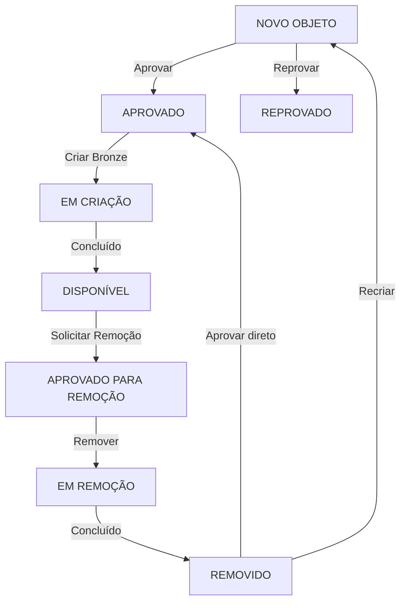

# PostgreSQL Medallion
Automação e funções avançadas em PostgreSQL (plpgsql) para criação, gestão e governança de uma arquitetura medalhão (raw, bronze, silver, gold) em data warehouses. Inclui catálogo lógico, workflows de status e sincronização automática entre camadas.

# Data Catalog & Bronze Layer Automation

Automação e governança de metadados em PostgreSQL (plpgsql) para criação, manutenção e remoção automática da camada bronze em arquiteturas medalhão (raw → bronze → silver → gold). Inclui catálogo lógico completo, workflows de status, padronização de tipos e sincronização com a camada raw (CDC).

## 📘 Visão Geral

Esta etapa do projeto implementa um **Catálogo Lógico de Dados** dentro do PostgreSQL, responsável por controlar e automatizar a criação da camada **bronze** a partir da camada **raw**.  
A arquitetura garante:

- Governança completa do ciclo de vida dos objetos  
- Padronização da camada bronze (todas as colunas convertidas para TEXT)  
- Automação auditável e segura  
- Rastreabilidade ponta a ponta  
- Redução de esforço operacional  

## 📂 Estrutura do Catálogo
O catálogo é composto pelas seguintes entidades:
* tb_status
* tb_payload_period
* tb_databases
* tb_schemas
* tb_tables
* tb_data_types
* tb_columns
* vw_catalog

## 1. Workflow de Status
Todos os objetos seguem o fluxo:
* 1  NOVO OBJETO (ANALISAR)
* 2  APROVADO DATA PLATFORM
* 3  REPROVADO DATA PLATFORM
* 4  EM CRIAÇÃO DATA PLATFORM
* 5  DISPONÍVEL DATA PLATFORM
* 6  APROVADO PARA REMOÇÃO DATA PLATFORM
* 7  EM REMOÇÃO DATA PLATFORM
* 8  REMOVIDO DATA PLATFORM

As transições são validadas pela função: `data_catalog.tg_status_object_restriction()`

## 2. Tabelas do Catálogo

### 2.1 `tb_status` — Workflow de Governança

| Coluna | Tipo | Descrição |
|--------|------|-----------|
| id | SERIAL (PK) | Identificador |
| name | VARCHAR(100) | Nome do status |
| created_at | TIMESTAMP | Timestamp de criação |

**Registros padrão:**  
NOVO OBJETO, APROVADO, REPROVADO, EM CRIAÇÃO, DISPONÍVEL, APROVADO PARA REMOÇÃO, EM REMOÇÃO, REMOVIDO.

### 2.2 `tb_payload_period` — Periodicidade de Carga

| Coluna | Tipo | Descrição |
|--------|------|-----------|
| id | SERIAL (PK) | Identificador |
| name | VARCHAR(100) | Nome do período |
| minutes | INTEGER | Intervalo em minutos |
| created_at | TIMESTAMP | Timestamp de criação |

**Registros padrão:**  
5, 10, 30, 60, 180, 360, 720, 1444 minutos.

### 2.3 `tb_databases` — Catálogo de Bancos

| Coluna | Tipo | Descrição |
|--------|------|-----------|
| id | VARCHAR(32) (PK) | MD5 do nome |
| tb_status_id | INTEGER (FK) | Status |
| name | VARCHAR(250) | Nome |
| description | VARCHAR(250) | Obrigatória |
| active | BOOLEAN | Ativo/inativo |
| created_at | TIMESTAMP | Inserção |
| updated_at | TIMESTAMP | Última mudança |

### 2.4 `tb_schemas` — Catálogo de Schemas

| Coluna | Tipo | Descrição |
|--------|------|-----------|
| id | VARCHAR(32) (PK) | MD5 do nome |
| tb_databases_id | VARCHAR(32) (PK, FK) | Database pai |
| tb_status_id | INTEGER (FK) | Status |
| name | VARCHAR(250) | Nome |
| description | VARCHAR(250) | Obrigatória |
| active | BOOLEAN | Ativo/inativo |
| created_at | TIMESTAMP | Inserção |
| updated_at | TIMESTAMP | Última mudança |

### 2.5 `tb_tables` — Catálogo de Tabelas

| Coluna | Tipo | Descrição |
|--------|------|-----------|
| id | VARCHAR(32) (PK) | MD5 do nome |
| tb_databases_id | VARCHAR(32) (PK, FK) | Database pai |
| tb_schemas_id | VARCHAR(32) (PK, FK) | Schema pai |
| tb_status_id | INTEGER (FK) | Status |
| tb_payload_period_id | INTEGER (FK) | Periodicidade |
| name | VARCHAR(250) | Nome |
| description | VARCHAR(250) | Obrigatória |
| active | BOOLEAN | Ativo/inativo |
| created_at | TIMESTAMP | Inserção |
| updated_at | TIMESTAMP | Última mudança |

### 2.6 `tb_data_types` — Tipos de Dados Permitidos

| Coluna | Tipo | Descrição |
|--------|------|-----------|
| data_type | VARCHAR (PK) | Tipo permitido |

**Inclui:**  
SMALLINT, INTEGER, BIGINT, NUMERIC, DECIMAL, VARCHAR, TEXT, DATE, TIMESTAMP, BOOLEAN, JSON, JSONB, UUID, MONEY, INET.

### 2.7 `tb_columns` — Catálogo de Colunas

| Coluna | Tipo | Descrição |
|--------|------|-----------|
| id | VARCHAR(32) (PK) | MD5 do nome |
| tb_databases_id | VARCHAR(32) (PK, FK) | Database pai |
| tb_schemas_id | VARCHAR(32) (PK, FK) | Schema pai |
| tb_tables_id | VARCHAR(32) (PK, FK) | Tabela pai |
| tb_status_id | INTEGER (FK) | Status |
| name | VARCHAR(250) | Nome |
| description | VARCHAR(250) | Obrigatória |
| data_type | VARCHAR(100) (FK) | Tipo original |
| is_pk | BOOLEAN | Indica PK |
| active | BOOLEAN | Ativo/inativo |
| created_at | TIMESTAMP | Inserção |
| updated_at | TIMESTAMP | Última mudança |

## 3. View Consolidada — `vw_catalog`

A view unifica:

* Databases
* Schemas  
* Tabelas  
* Colunas  
* Status  
* Periodicidade  
* Tipos de dados  
* Flags de atividade

## 4. Fluxo Completo Raw → Bronze



## 5. Regras de Governança

```
NOVO OBJETO → {NOVO OBJETO, APROVADO, REPROVADO}
APROVADO → {EM CRIAÇÃO}
REPROVADO → {NOVO OBJETO, APROVADO}
EM CRIAÇÃO → {DISPONÍVEL}
DISPONÍVEL → {APROVADO PARA REMOÇÃO}
APROVADO PARA REMOÇÃO → {EM REMOÇÃO}
EM REMOÇÃO → {REMOVIDO}
REMOVIDO → {NOVO OBJETO, APROVADO}
```

## 6. Automação da Bronze

A função data_catalog.bronze_layer executa:

* Criação de schemas bronze
* Criação de tabelas bronze
* Conversão de tipos para TEXT
* Criação de PKs
* Sincronização de alterações
* Remoção de objetos aprovados

## 7. Benefícios

* Governança completa
* Padronização total
* Automação auditável
* Rastreabilidade ponta a ponta
* Redução de esforço manual
* Base sólida para silver e gold

## 8. Licença
MIT License © Daniel Robert Costa
